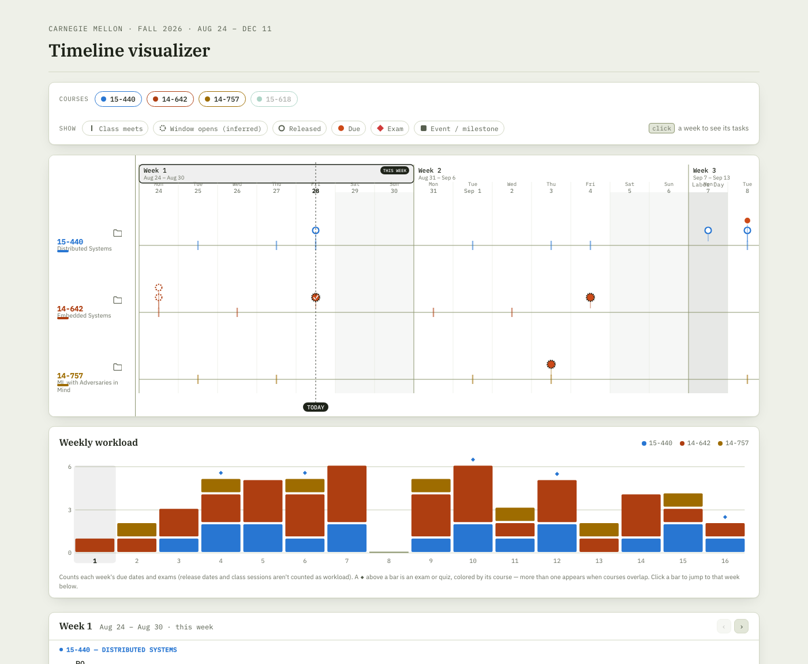

# Fall 2026 Timeline

A one-page semester dashboard for four Fall 2026 courses — merges four separate course schedules into a single visual timeline, a weekly workload chart, and a checkable task list, so there's no need to cross-reference four different Canvas pages.



## Features

- **Day-by-day timeline** — every class, release, due date, exam, and event across all four courses on one scrollable SVG chart, with a "this week" marker and a dotted line for today.
- **Course & type filters** — toggle a course or an item type (class / window opens / released / due / exam / event) on or off. Turning a course off removes it everywhere at once — timeline, workload chart, week tasks, and its policy card — and the timeline itself reflows to fit however many courses are showing.
- **Weekly workload chart** — a stacked bar per week counting due dates and exams (release dates and class sessions aren't counted as workload), with exam/quiz markers on top. Click a bar to jump to that week.
- **Week panel** — the current week's tasks with checkboxes and free-text notes that save automatically. Checking a task off also marks its matching pin in the timeline with a checkmark.
- **Missing-start-date flag** — any task with only a due date and no known release or window-open date is called out with a badge in the week panel and a distinct dashed ring on its timeline pin, so it doesn't read as more certain than it is.
- **Course policy cards** — late-day, grading, and AI-use policy per course, transcribed from each syllabus with a source and date.
- **Plain-list fallback view** — every date in one sortable, screen-reader-friendly table.
- **Copy folder path** — one click to copy a course's local folder path (paste into Finder's Go to Folder).
- **Light/dark theme**, keyboard focus states, and `prefers-reduced-motion` support throughout.

## Running it

It's a static file — open `index.html` directly, or serve it locally:

```
python3 server.py
```

then open http://localhost:8000/index.html. This also persists checkbox/note state to a local SQLite file (`state.db`) so it survives across browsers, not just one browser's `localStorage`. Opening `index.html` directly (no server) still works — it just falls back to `localStorage` only.

## Updating the schedule

All schedule data (dates, lecture topics, assignment names, exam dates) lives in the `viz-data` JSON block embedded in `index.html`. It's transcribed by hand from each course's syllabus/schedule PDFs and Canvas assignments page, so it goes stale if a syllabus is amended — always double check anything that actually matters against Canvas or the instructor.
